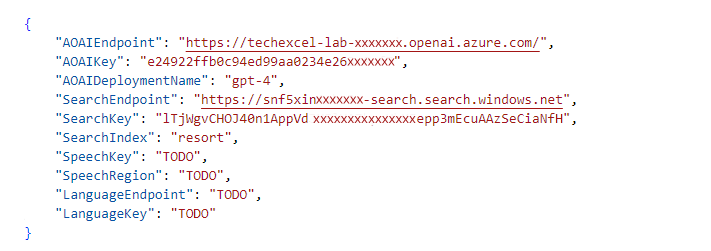

# Task 03 - Add custom chat to a Streamlit dashboard (10 minutes)

## Introduction

The Azure AI Studio Chat playground is a good place to try out functionality such as adding your own data and chatting with an assistant, but it is not the only way to enable this communication. It is also possible to integrate Azure OpenAI resources into existing code bases in a variety of languages, including C#, F#, Java, JavaScript, Python, and any language supporting interactions with REST APIs.

## Description

Now that you have demonstrated some of the capabilities around Azure OpenAI and using custom data to inform responses, the Contoso Suites development team would like to incorporate an Azure OpenAI ChatGPT model in their website. To simplify matters, they would like you to demonstrate in a Streamlit dashboard how we can incorporate chat capabilities. They are not particularly concerned about user interface niceties, as that is something they are capable of doing. Instead, they want you to demonstrate the integration process.

The key tasks are as follows:

1. In the `src\ContosoSuitesDashboard` folder, install all of the packages in **requirements.txt**.
2. Fill in the contents of `config.json` with relevant values from your Azure OpenAI service and from your Azure AI Search service. You will fill in the following variables: `AOAIEndpoint`, `AOAIKey`, `AOAIDeploymentName`, `SearchEndpoint`, `SearchKey`, and `SearchIndex`. Leave the remaining variables alone for now. You can find the Azure OpenAI endpoint, key, and deployment name in the Azure portal, specifically the **Keys and Endpoint** option under the **Resource Management** menu for your Azure OpenAI service. You can find the search endpoint search key in the Azure portal as well, specifically the **Keys** option under the **Settings** menu for your Azure AI Search service. The search index is the index that you created in Exercise 02, Task 02 (Example below).
    

    > This `config.json` file is intended for demonstrating a Streamlit dashboard locally. Outside of a demonstration scenario, you would want to use [a combination of environment variables, Azure Key Vault, and Streamlit secrets](https://techcommunity.microsoft.com/t5/healthcare-and-life-sciences/how-to-secure-azure-openai-keys-using-environment-variables/ba-p/3821162) to manage these details.

    > When filling in the **AOAIEndpoint** and **SearchEndpoint** configuration settings, be sure to include the `https://` part of the URL.

3. After loading the Streamlit page, ask the following question: "Our family is celebrating my mother's 90th birthday and we want to have that celebration in Aruba. Do you have a hotel that can accommodate 19 room rentals? And are there any reception rooms at that hotel?"

    > Use the following command in a terminal to run Streamlit: `streamlit run Index.py`. You must be in the `src\ContosoSuitesDashboard` directory in your terminal, must have Python installed, and must have installed requirements, including Streamlit. After running this command, you will be able to view the Streamlit app in your web browser by navigating to the URL displayed in the terminal.

4. Continue the chat conversation with this follow-up: "What other amenities does that hotel have?"

## Success Criteria

- Website users are able to enter their prompts into a textbox and submit the prompt to Azure OpenAI.
- The resulting response will appear on the webpage as a chat response.
- Session history is retained as long as the Streamlit dashboard is open but refreshing the page will reset session history.

## Learning Resources

- [Quickstart: Chat with Azure OpenAI models using your own data](https://learn.microsoft.com/azure/ai-services/openai/use-your-data-quickstart?tabs=powershell%2Cpython&pivots=programming-language-python)
- [Sample Chat App with AOAI](https://github.com/microsoft/sample-app-aoai-chatGPT/tree/main)
- [Sample 08 - Use your own data](https://github.com/Azure/azure-sdk-for-net/blob/main/sdk/openai/Azure.AI.OpenAI/tests/Samples/Sample08_UseYourOwnData.cs)
- [Build a conversational app with Streamlit](https://docs.streamlit.io/knowledge-base/tutorials/build-conversational-apps)

## Solution

- Be sure that all Python packages are installed before trying to run Streamlit. At the command line and inside the `src\ContosoSuitesDashboard\` folder, execute the following command: `pip install -r requirements.txt`
- Modify the `config.json` file to fill in values for each of the configuration settings. For **AOAIEndpoint** and **SearchEndpoint**, you will want to include this as a URL, starting with `https://`.

## How the code works

- The `main()` function acts as the control function for this page. It initializes the chat history and displays it on each page refresh. Then, it calls `handle_prompt()` to handle the user's prompt. `handle_prompt()` then calls `handle_chat_prompt()` to send the text of a message to the Azure OpenAI service.
- The `handle_chat_prompt()` function does two things: it echoes the user's prompt to the chat window, and then it sends the prompt to Azure OpenAI and writes the resulting message to the chat window.
  - `handle_chat_prompt()` function is as follows:

    ```python
    # Echo the user's prompt to the chat window
    st.session_state.messages.append({"role": "user", "content": prompt})
    with st.chat_message("user"):
        st.markdown(prompt)

    # Send the user's prompt to Azure OpenAI and display the response
    # The call to Azure OpenAI is handled in create_chat_completion()
    # This function loops through the responses and displays them as they come in.
    # It also appends the full response to the chat history.
    with st.chat_message("assistant"):
        message_placeholder = st.empty()
        full_response = ""
        for response in create_chat_completion(deployment_name, st.session_state.messages, config["SearchEndpoint"], config["SearchKey"], config["SearchIndex"]):
            full_response += (response.choices[0].delta.content or "")
            message_placeholder.markdown(full_response + "▌")
        message_placeholder.markdown(full_response)
    st.session_state.messages.append({"role": "assistant", "content": full_response})
    ```

- The `create_chat_completion()` function reaches out to Azure OpenAI and performs the chat completion, ensuring that we only include information from our Azure AI Search index.
  - `create_chat_completion()` function is as follows:

    ```python
    # Create an Azure OpenAI client. We create it in here because each exercise will
    # require at a minimum different base URLs.
    client = openai.AzureOpenAI(
        base_url=f"{aoai_endpoint}/openai/deployments/{deployment_name}/extensions/",
        api_key=aoai_api_key,
        api_version="2023-12-01-preview"
    )
    # Create and return a new chat completion request
    # Be sure to include the "extra_body" parameter to use Azure AI Search as the data source
    return client.chat.completions.create(
        model=deployment_name,
        messages=[
            {"role": m["role"], "content": m["content"]}
            for m in messages
        ],
        stream=True,
        extra_body={
            "dataSources": [
                {
                    "type": "AzureCognitiveSearch",
                    "parameters": {
                        "endpoint": endpoint,
                        "key": key,
                        "indexName": index_name,
                    }
                }
            ]
        }
    )
    ```
