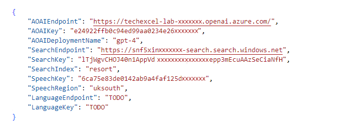

# Task 02 - Perform speech requests with Streamlit (20 minutes)

## Introduction

Azure OpenAI has the capacity to parse natural language in textual format. We can also incorporate Azure AI Services and its Speech service to perform speech-to-text transcription, enabling us to use the output of the Speech service as an input for OpenAI prompts. Throughout the course of this exercise, you will create an Azure AI Services Speech service and test it out in the OpenAI Studio Chat playground. Then, you will incorporate the service in your existing Streamlit dashboard.

## Description

In this task, you will use the Azure AI Services Speech service that you created in the prior task in the Streamlit app's Chat with Data page. With it, you will be able to capture an utterance from a microphone and, if the Speech service was able to recognize the input audio as speech, submit the text to the Azure OpenAI service as a prompt.

The key tasks are as follows:

1. Open the `config.json` file. Fill in the properties for `SpeechKey` and `SpeechRegion` with the appropriate details from your Azure AI Services Speech service. (Example below).
    
2. note:
    > Because of the way Streamlit displays chat text, we cannot easily display diagnostic text messages on the screen. For this reason, the `recognize_from_microphone()` function prints out messages. You can see these messages in the console you used to run Streamlit and can use that for troubleshooting.

    > Because of the way Streamlit displays chat text, using the speech to text button will actually cause its location to move further down the page below the chat history. This is a known oddity in the way Streamlit handles display and [might be fixed in a future version of the product](https://github.com/streamlit/streamlit/issues/7296) but it will not interfere with your ability to complete this task.

3. Ensure you have selected "Chat with Data" as the radio button option. Then, using your microphone, speak the following request: "I've visited Ireland and Scotland before and would like to visit somewhere else. What other resort locations would be good options if I want to scuba dive?" Ensure that the speech service correctly interprets your utterance and the button's action calls the Azure OpenAI service.
4. Select the "Function Calls" chat option. Then, using your microphone, speak the following request: "Show me a list of all users in the Silver loyalty tier."

## Success Criteria

- You have updated the config.json file.
- You are able to translate microphone inputs to text utterances and send them to the Azure OpenAI service

## Learning Resources

- [What is the Speech service?](https://learn.microsoft.com/azure/ai-services/speech-service/overview)
- [Quickstart: Recognize and convert speech to text](https://learn.microsoft.com/azure/ai-services/speech-service/get-started-speech-to-text?tabs=windows%2Cterminal&pivots=programming-language-python)
- [Azure OpenAI speech to speech chat](https://learn.microsoft.com/azure/ai-services/speech-service/openai-speech)
- [st.button](https://docs.streamlit.io/library/api-reference/widgets/st.button)
- [Chat messages on top, forms at bottom (alternative solution )](https://discuss.streamlit.io/t/chat-messages-on-top-forms-at-bottom/48474)

## Tips

- The speech to text function looks for the default microphone on your machine. If you are connecting through a virtual machine or do not have a microphone installed, you may get back `speechsdk.ResultReason.NoMatch` when you are speaking.
- Azure speech recognition has a fairly short default timeout, so if you do not speak for a few seconds, it may time out before you have a chance to speak.
- [Test you microphone](https://www.onlinemictest.com/) is working outside of Teams as Teams can sometimes limit its functional capability. You may need to shut down Teams when carrying out the microphone test.

## Solution

- Modify the `config.json` file to fill in values for the `SpeechKey` and `SpeechRegion` configuration settings. You can find these in the **Keys and Endpoint** option of the **Resource Management** menu. Be sure to use the region name as it appears on that page, so for example, UK South should show up as "uksouth" in your JSON file.

## How the code works

- The `recognize_from_microphone()` function uses the Azure AI Services Speech service to accept microphone input and then attempts to convert the audio input into an utterance. If this succeeds, the function returns the translated text. If this function fails, it returns None.
  - The code for the `recognize_from_microphone()` function is as follows:

    ```python
    # Create an instance of a speech config with specified subscription key and service region.
    speech_config = speechsdk.SpeechConfig(subscription=speech_key, region=speech_region)
    speech_config.speech_recognition_language=speech_recognition_language

    # Create a microphone instance and speech recognizer.
    audio_config = speechsdk.audio.AudioConfig(use_default_microphone=True)
    speech_recognizer = speechsdk.SpeechRecognizer(speech_config=speech_config, audio_config=audio_config)

    # Start speech recognition
    print("Speak into your microphone.")
    speech_recognition_result = speech_recognizer.recognize_once_async().get()

    # Check the result
    if speech_recognition_result.reason == speechsdk.ResultReason.RecognizedSpeech:
        print("Recognized: {}".format(speech_recognition_result.text))
        return speech_recognition_result.text
    elif speech_recognition_result.reason == speechsdk.ResultReason.NoMatch:
        print("No speech could be recognized: {}".format(speech_recognition_result.no_match_details))
        return None
    elif speech_recognition_result.reason == speechsdk.ResultReason.Canceled:
        cancellation_details = speech_recognition_result.cancellation_details
        print("Speech Recognition canceled: {}".format(cancellation_details.reason))
        if cancellation_details.reason == speechsdk.CancellationReason.Error:
            print("Error details: {}".format(cancellation_details.error_details))
            print("Did you set the speech resource key and region values?")
        return None
    ```
