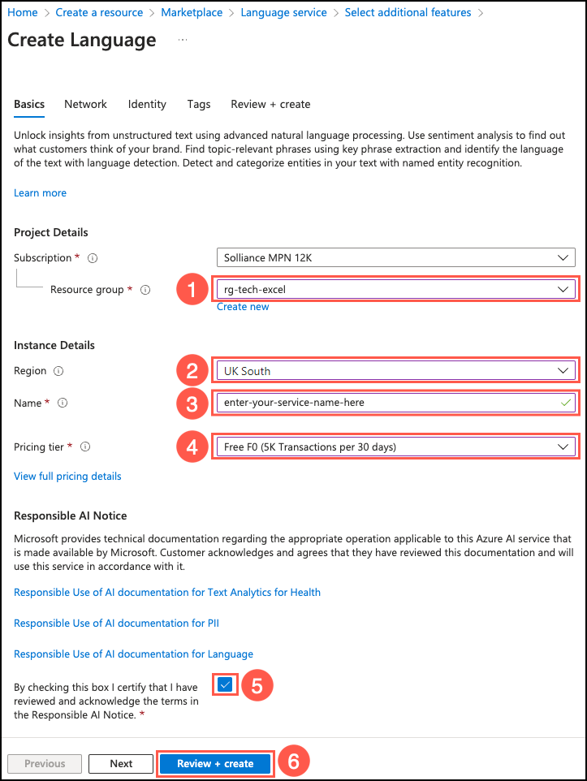
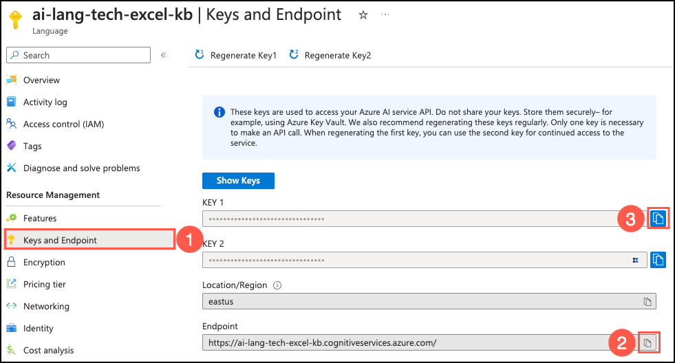

# Task 01 - Generate a call summary from a transcribed recorded support call (20 minutes)

## Introduction

The intent of text summarization is to shorten content that users consider too long to read. AI-based summarization focuses on highlighting the most important aspects of the text. Azure AI Services provide several mechanism for summarizing text. The Language service provides extractive and abstractive summarization functions, both of which condense text or documents into key sentences.

- **Extractive summarization**: Creates a summary by extracting sentences that collectively represent the most important or relevant information within the original content.
- **Abstractive summarization**: Produces a summary by generating summarized sentences from the document that capture the main idea.

In addition to the summarization capabilities of the Azure AI Services Language service, the Azure OpenAI service also enables the ability to perform query-based summarization, leveraging the power of large language models. The service uses a generative completion model to generate a summary from text. The model uses natural language instructions to identify the requested task and the skill required, a process known as **prompt engineering**.

In this exercise, you will create an Azure AI Services Language service and compare the outputs of its extractive and abstractive summarization functions to the output of Azure OpenAI's query-based text summarization.

## Description

In this task, you create an Azure AI Services Language service and use it to summarize the transcript of a customer call generated in the `2_Call_Center.py` page of your Streamlit application. using three different Azure AI Services, you will compare the results from each.

The key tasks are as follows:

1. Create an Azure AI Services Language Service in the Azure portal. Make sure it is in the same resource group and region as your OpenAI service.
2. Set the `LanguageEndpoint` and `LanguageKey` values in `config.json` file in the `ContosoSuitesDashboard` folder based on your new Language service. (Example below).
  - 
3. Upload the `03_Customer_Service_Call.wav` file to generate a transcription, then summarize this value.
4. Use the `generate_abstractive_summary()` function to summarize the call transcript from the `03_Customer_Service_Call.wav` file.
5. Use the `generate_query_based_summary()` function to summarize the call transcript from the `03_Customer_Service_Call.wav` file.
6. Compare the summary generated by each function.

## Success criteria

- You have created an Azure AI Services Language service.
- You have used the `generate_extractive_summary()` function to extractive summarization results to the Streamlit dashboard in JSON format.
- You have used the `generate_abstractive_summary()` function and are able to output the generated abstractive summary to the Streamlit dashboard in JSON format.
- You have used the `generate_query_based_summary()` function and are able to output the generated 5 word and the 2 sentence summaries in JSON format to the Streamlit dashboard.

## Learning resources

- [What is Azure AI Language?](https://learn.microsoft.com/azure/ai-services/language-service/overview)
- [What is document and conversation summarization?](https://learn.microsoft.com/azure/ai-services/language-service/summarization/overview?tabs=document-summarization)
- [How to use document summarization](https://learn.microsoft.com/azure/ai-services/language-service/summarization/how-to/document-summarization)
- [Quickstart: Using extractive summarization](https://learn.microsoft.com/azure/ai-services/language-service/summarization/quickstart?tabs=document-summarization&pivots=programming-language-python#code-example)
- [Quickstart: Get started using GPT-35-Turbo and GPT-4 with Azure OpenAI Service](https://learn.microsoft.com/azure/ai-services/openai/chatgpt-quickstart?tabs=command-line%2Cpython&pivots=programming-language-python)
- [Query-based document summarization](https://learn.microsoft.com/azure/architecture/ai-ml/guide/query-based-summarization)
- [st.error](https://docs.streamlit.io/library/api-reference/status/st.error)
- [st.spinner](https://docs.streamlit.io/library/api-reference/status/st.spinner)
- [st.success](https://docs.streamlit.io/library/api-reference/status/st.success)
- [Streamlit Session State](https://docs.streamlit.io/library/api-reference/session-state)

## Solution

- The steps to create an Azure AI Services Language service in the Azure portal are as follows:
  - Navigate to the [Azure portal](https://portal.azure.com/).
  - Select **Create a resource** under **Azure services** on the Azure home page, then enter "Language service" into the **Search the Marketplace** box on the Marketplace page and select the **Language service** tile in the search results.
  - Select **Create** on the **Language service** page to create a new language service resource.
  - Select **Continue to create your resource** on the **Select additional features** page.
  - On the Create Language **Basics** tab, ensure you select the same resource group and region that you chose for your Azure OpenAI service. Provide a _globally unique_ service name. You can choose either the **Free F0** or **S** pricing tier for this service.
  - Ensure the box certifying you have reviewed and acknowledge the terms in the Responsible AI Notice is checked.
  - Select the **Review + create** button to review your choices and then select **Create** to provision the service.

    

- The steps to retrieve the endpoint and key values for your Language service and add them to `config.json` are as follows:
  - Navigate to your Language service resource in the [Azure portal](https://portal.azure.com/).
  - Select the **Keys and Endpoint** menu item under **Resource Management** in the left-hand menu.
  - Copy the **Endpoint** value and paste it into the `config.json` file as the **LanguageEndpoint** value.
  - Copy the **KEY 1** value and paste it into the `config.json` file as the **LanguageKey** value.

    

## How the code works

- The `generate_extractive_summary()` function, in the `2_Call_Center.py` file, uses the Azure AI Services Language service's `TextAnalyticsClient` with an `ExtractiveSummaryAction` action to summarize the text within a document. This action returns a `sentences` array as part of its result, which contains the summary sentences. The code to implement this function is as follows:

    ```python
    def generate_extractive_summary(call_contents):
        # The call_contents parameter is formatted as a list of strings. Join them together with spaces to pass in as a single document.
        joined_call_contents = ' '.join(call_contents)
    
        # Create a TextAnalyticsClient, connecting it to your Language Service endpoint.
        client = TextAnalyticsClient(language_endpoint, AzureKeyCredential(language_key))
        # Call the begin_analyze_actions method on your client, passing in the joined call_contents as an array and an ExtractiveSummaryAction with a max_sentence_count of 2.
        poller = client.begin_analyze_actions(
            [joined_call_contents],
            actions = [
                ExtractiveSummaryAction(max_sentence_count=2)
            ]
        )
    
        # Extract the summary sentences and merge them into a single summary string.
        for result in poller.result():
            summary_result = result[0]
            if summary_result.is_error:
                st.error(f'Extractive summary resulted in an error with code "{summary_result.code}" and message "{summary_result.message}"')
                return ''
            
            extractive_summary = " ".join([sentence.text for sentence in summary_result.sentences])

        # Return the summary as a JSON object in the shape '{"call-summary": extractive_summary}'
        return json.loads('{"call-summary":"' + extractive_summary + '"}')
    ```

- The code to implement the "Generate extractive summary" button in the `main()` function is as follows:

    ```python
    if st.button("Generate extractive summary"):
        # Set call_contents to file_transcription_results. If it is empty, write out an error message for the user.
        if 'file_transcription_results' in st.session_state:
            # Use st.spinner() to wrap the summarization process.
            with st.spinner("Generating extractive summary..."):
                if 'extractive_summary' in st.session_state:
                    extractive_summary = st.session_state.extractive_summary
                else:
                    # Call the generate_extractive_summary function and set its results to a variable named extractive_summary.
                    extractive_summary = generate_extractive_summary(st.session_state.file_transcription_results)
                    # Save the extractive_summary value to session state.
                    st.session_state.extractive_summary = extractive_summary

                # Call st.success() to indicate that the extractive summarization process is complete.
                if extractive_summary is not None:
                    st.success("Extractive summarization complete!")
        else:
            st.error("Please upload an audio file or record a call before attempting to generate a summary.")

    # Write the extractive_summary value to the Streamlit dashboard.
    if 'extractive_summary' in st.session_state:
        st.write(st.session_state.extractive_summary)
    ```

- Like the `generate_extractive_summary()` function above, the `generate_abstractive_summary()` function also uses the Azure AI Services Language service's `TextAnalyticsClient` to summarize the text within a document. To perform abstractive summarization, however, it uses the `AbstractiveSummaryAction` action. With abstractive summarization, the summary result returns a `summaries` array versus the `sentences` array returned by the `ExtractiveSummaryAction`. The code to implement the `generate_abstractive_summary()` function is as follows:

    ```python
    def generate_abstractive_summary(call_contents):
        # The call_contents parameter is formatted as a list of strings. Join them together with spaces to pass in as a single document.
        joined_call_contents = ' '.join(call_contents)
    
        # Create a TextAnalyticsClient, connecting it to your Language Service endpoint.
        client = TextAnalyticsClient(language_endpoint, AzureKeyCredential(language_key))

        # Call the begin_analyze_actions method on your client, passing in the joined call_contents as an array and an AbstractiveSummaryAction with a sentence_count of 2.
        poller = client.begin_analyze_actions(
            [joined_call_contents],
            actions = [
                AbstractiveSummaryAction(sentence_count=2)
            ]
        )
    
        # Extract the summary sentences and merge them into a single summary string.
        for result in poller.result():
            summary_result = result[0]
            if summary_result.is_error:
                st.error(f'...Is an error with code "{summary_result.code}" and message "{summary_result.message}"')
                return ''
            
            abstractive_summary = " ".join([summary.text for summary in summary_result.summaries])

        # Return the summary as a JSON object in the shape '{"call-summary": abstractive_summary}'
        return json.loads('{"call-summary":"' + abstractive_summary + '"}')
    ```

- The code to implement the "Generate abstractive summary" button in the `main()` function is as follows:

    ```python
    if st.button("Generate abstractive summary"):
        # Set call_contents to file_transcription_results. If it is empty, write out an error message for the user.
        if 'file_transcription_results' in st.session_state:
            # Use st.spinner() to wrap the summarization process.
            with st.spinner("Generating abstractive summary..."):
                # Call the generate_abstractive_summary function and set its results to a variable named abstractive_summary.
                abstractive_summary = generate_abstractive_summary(st.session_state.file_transcription_results)
                # Save the abstractive_summary value to session state.
                st.session_state.abstractive_summary = abstractive_summary
    
                # Call st.success() to indicate that the extractive summarization process is complete.
                if abstractive_summary is not None:
                    st.success("Abstractive summarization complete!")
        else:
            st.error("Please upload an audio file or record a call before attempting to generate a summary.")
    
    # Write the abstractive_summary value to the Streamlit dashboard.                
    if 'abstractive_summary' in st.session_state:
        st.write(st.session_state.abstractive_summary)
    ```

- The code to implement the `generate_azure_openai_summarization()` function is far simpler and makes use of the `make_azure_openai_chat_request()` function you completed as part of Exercise 05, Task 03. The code for the `generate_azure_openai_summarization()` function is as follows:

    ```python
    def generate_query_based_summary(call_contents):
        # The call_contents parameter is formatted as a list of strings. Join them together with spaces to pass in as a single document.
        joined_call_contents = ' '.join(call_contents)
    
        # Write a system prompt that instructs the large language model to:
        #    - Generate a short (5 word) summary from the call transcript.
        #    - Create a two-sentence summary of the call transcript.
        #    - Output the response in JSON format, with the short summary labeled 'call-title' and the longer summary labeled 'call-summary.'
        system = f"""
            Write a five-word summary and label it as call-title.
            Write a two-sentence summary and label it as call-summary.
    
            Output the results in JSON format.
        """
    
        # Call make_azure_openai_chat_request().
        response = make_azure_openai_chat_request(system, joined_call_contents)

        # Return the summary.
        return response.choices[0].message.content
    ```

- The code to implement the "Generate query-based summary" button in the `main()` function is as follows:

    ```python
    if st.button("Generate query-based summary"):
        # Set call_contents to file_transcription_results. If it is empty, write out an error message for the user.
        if 'file_transcription_results' in st.session_state:
            # Use st.spinner() to wrap the summarization process.
            with st.spinner("Generating Azure OpenAI summary..."):
                # Call the generate_query_based_summary function and set its results to a variable named openai_summary.
                openai_summary = generate_query_based_summary(st.session_state.file_transcription_results)
                # Save the openai_summary value to session state.
                st.session_state.openai_summary = openai_summary

                # Call st.success() to indicate that the query-based summarization process is complete.
                if openai_summary is not None:
                    st.success("Azure OpenAI query-based summarization complete!")
        else:
            st.error("Please upload an audio file or record a call before attempting to generate a summary.")

    # Write the openai_summary value to the Streamlit dashboard.
    if 'openai_summary' in st.session_state:
        st.write(st.session_state.openai_summary)
    ```
